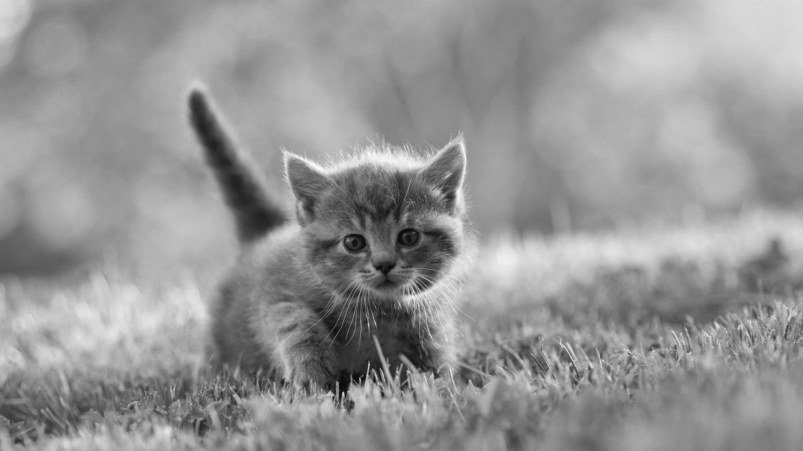
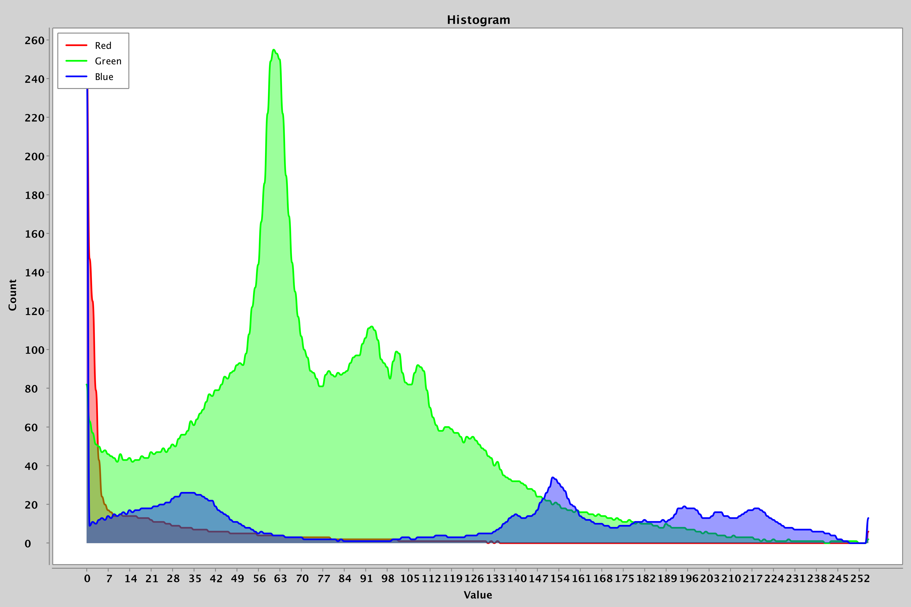

# Parallel-Image-processing

# ToC
1. [Converting an Image to Greyscale](#converting-an-image-to-greyscale)
2. [Changing Image Brightness](#changing-image-brightness)
3. [Creating Image RGB Histogram](#creating-image-rgb-histogram)
4. [Project](#project)
5. [Logger](#logger)

# Converting an Image to Greyscale

### Example:

```java
ParallelImageProcessor processor = new GreyScaleProcessor(2);
ProcessorResult result = processor.processImage(file);
BufferedImage image = result.getImage();
```

### Short version:

```java
ParallelImageProcessor processor = new GreyScaleProcessor(2);
BufferedImage image = processor.processImage(file).getImage();
```

|  |   |
|:-:|:-:|
| **Original Image**  | **Original Image in Greyscale** |

# Changing Image Brightness

### Example:

```java
ParallelImageProcessor processor = new BrightnessProcessor(2, 2.0);
ProcessorResult result = processor.processImage(file);
BufferedImage image = result.getImage();
```

|  |   |
|:-:|:-:|
| **Original Image**  | **Original Image with increased brightness** |

# Creating Image RGB Histogram

### Example:

```java
ParallelImageProcessor processor = new HistogramProcessor(2);
ProcessorResult result = processor.processImage(file);
Histogram histogram = result.getHistogram();
histogram.saveHistogram(outputFile);
```

|  |   |
|:-:|:-:|
| **Original Image**  | **RGB Histogram of Original Image** |

The Histogram can also be shown in an interactive Interface:

```java
ParallelImageProcessor processor = new HistogramProcessor(threadPoolSize);
Histogram histogram = processor.processImage(file).getHistogram();
histogram.showHistogram();
```

# Project

The main Goal of this Project was to test different variants of processing images in java with Threads. Mainly two different Variant ‘Blocking’ and ‘Non-Blocking’ have been developed for each Task (RGB->Greyscale, RGB->Brightness and RGB->Histogram). The different Task and Variant can be seen in the [class UML](#class-uml).  
Both ‘Blocking’ and ‘Non-Blocking’ Task-variants share the Image file in the shared-memory to read data from it. This is not synchronized as it is thread-safe. 
The Non-Blocking variants uses non-shared-memory between Threads to store the results and merges them all together after all Threads have stopped. This gives the chance for each Threads to run in Parallel (still determined by OS).
The Blocking variant uses shared-memory to write directly the result (synchronized). This results to a higher thread run time but less overhead to retrieve the results after execution. 

### Class UML


# Logger
```java
private static final Logger logger = Logger.getInstance();

logger.start(Logger.TYPE.DEBUG, null);
logger.close();
